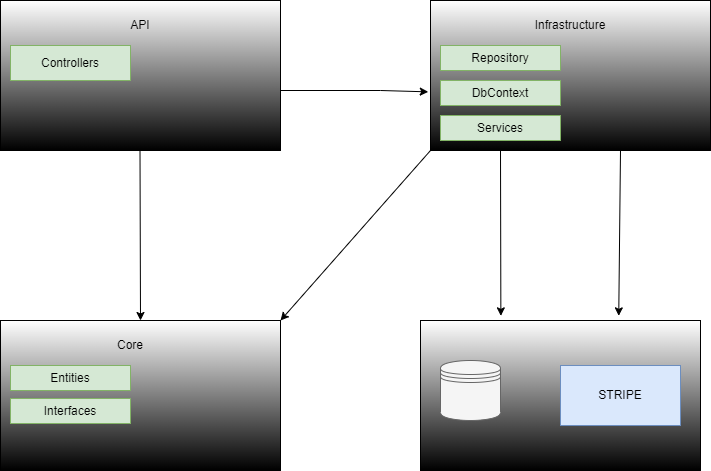
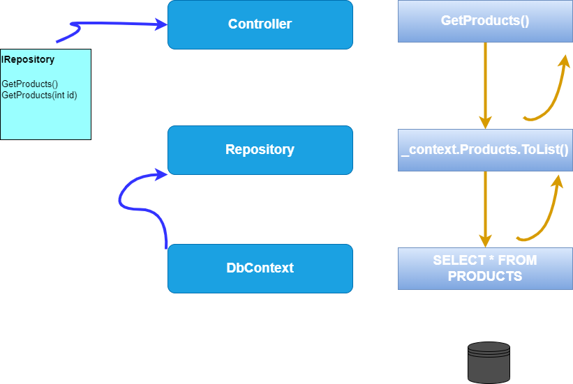
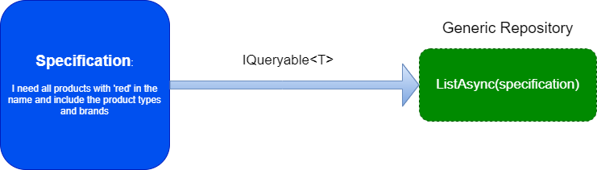

### POC App for a Skiing Store - SKINET

### Tech Stack
1. ASP.NET COre 6.0.3 for building WebAPI
2. Angular 12 for the front end UI
3. Stripe for Payment Processing

#### Basic App Architecture

We also make use of the Repository Pattern in the code for managing various Entities for the Skinet Store

We are using a generic repository (though it is argued as an an anti-pattern) but personally, it has its benefits
In order to get around the common problems usually found in usages of Generic Repositories, I derive specifc repositories to reduce excess generalization.

I will be using the Specification pattern to get around the shortcomings of the Generic Repository
Below is simple usecase of how the implementation looks like

